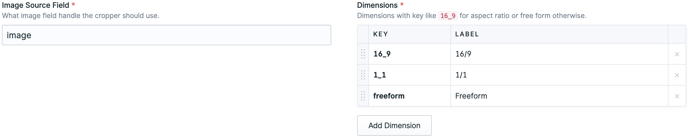

# Image Cropper

<!-- statamic:hide -->
[](https://packagist.org/packages/tv2regionerne/statamic-image-cropper)
[](https://packagist.org/packages/tv2regionerne/statamic-image-cropper)
[](LICENSE)
[](https://github.com/statamic/cms/releases)
<!-- /statamic:hide -->

This addon adds an image cropping fieldtype, for those cases where focal point cropping just isn't enough.

## Features

This fieldtype can be found under the "Media" category, and requires you to set `Image Source Field` and `Dimensions`.



If you rather want to do it YAML style, this is it:
```yaml
handle: crops
field:
  type: image_cropper
  display: Crops
  source: image
  dimensions:
    '1_1': 1/1
    '16_9': 16/9
    '3_4': 3/4
    '4_1': 4/1
```

## How to Install

You can search for this addon in the `Tools > Addons` section of the Statamic control panel and click **install**, or run the following command from your project root:

``` bash
composer require tv2regionerne/statamic-image-cropper
```

## How to Use

After setting up the fieldtype and have chosen an image, you get the option to select a dimension to crop:


Selecting a dimension will trigger the cropping overlay, and once you're happy with your crop you press `Save`:


In a template you can then use the crop as so:
```antlers

```

Enjoy cropping away!
